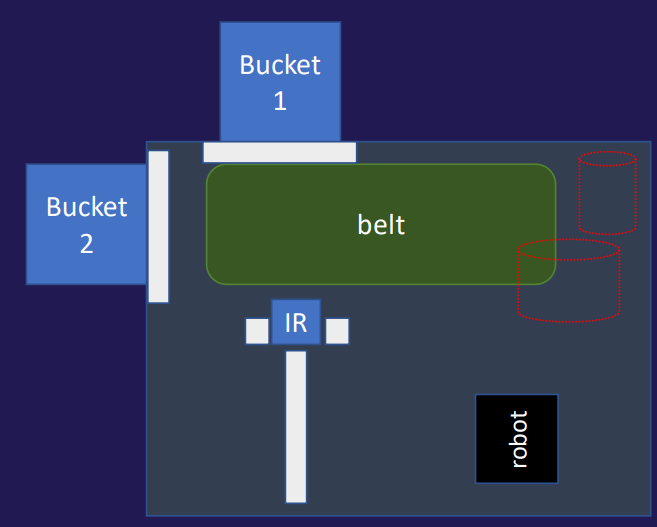
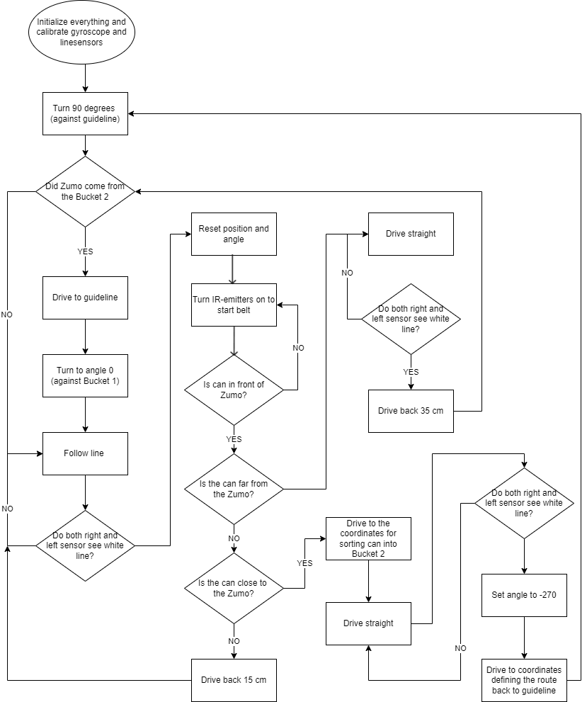

# P1 winning competition code
  

As part of a basic introduction to embedded programming using c++, we were to make a mini-project,
that would culminate into a competition against the other 1st semester groups of Robotics. 
The project’s main objective was to sort cans as fast as possible using a Zumo32U4 robot. An illustration of the platform, 
where the sorting process would go about, can be seen in the figure below. As the figure shows, the platform consists of a conveyor belt, where the cans
would be placed, and a few lines that would serve as a guideline for the Zumo32U4 to follow, in order
to be placed on top of an IR-receiver that would turn on the conveyor belt. The cans should be pushed
into Bucket 1 if they were placed far away from the robot and into Bucket 2 if they were placed close
to the robot. In this way, it was possible for the Zumo32U4 to sort the cans using its proximity sensors
that can estimate distances from the brightness levels of the reflected IR-lights. The competition was
divided into two parts, where the first part would test the sorting accuracy of the solution by giving it
10 cans and observing how many were sorted correctly. The second part was testing the efficiency of
the robot by giving it two minutes to correctly sort as many cans as possible. The groups’ tasks were
to write a program that would interact with the various sensors and other hardware components of the
Zumo32U4 needed to complete this competition. The written solution ended up winning the competition🏆

## Flowcharts
The following flowcharts illustrates the code flow of the solution. The first flowchart depicts the workflow of the two basic functions that enables the the Zumo to drive straight between two coordinates.
The other flowchart gives an overview of the main program.

## Contributors
This project was developed by group 176 on Aalborg University, Robot Technology at 1st semester.

<section id="sec_contributors">
<table>
  <tr> 
    <td align="center"><a target="_blank" rel="noreferrer noopener" href="https://github.com/signeskuldbol"> <b>Signe Møller-Skuldbøl</b></a> <a href="gttps://github.com/signeskuldbol" title="">👧</a></td>
    <td align="center"><a target="_blank" rel="noreferrer noopener" href="https://github.com/thor2643"> <b>Thor Iversen</b></a> <a href="gttps://github.com/thor2643" title="">👨‍🌾</a></td>
    <td align="center"><a target="_blank" rel="noreferrer noopener" href="https://github.com/silasjensen2001"> <b>Silas Jensen</b></a> <a href="gttps://github.com/silasjensen2001" title="">🤠</a></td>
  <td align="center"><a target="_blank" rel="noreferrer noopener" href="https://github.com/nicopiko"> <b>Nicolai Fosmark Stallknecht</b></a> <a href="gttps://github.com/nicopiko" title="">🐻</a></td>
  <td align="center"><a target="_blank" rel="noreferrer noopener" href="https://github.com/nikkokid"> <b>Nikolai Buurgaard Jørgensen</b></a> <a href="gttps://github.com/nikkokid" title="">😎</a></td>

  </tr>
</table>

